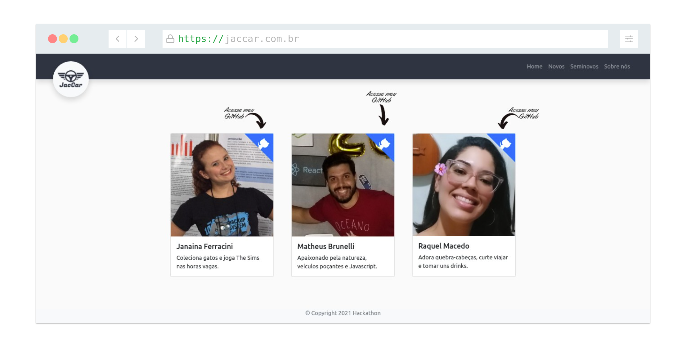

## Web Hackathon

### Layout

##### Mockup


##### Home page


##### About page


### How to execute?
1. Clone repo
```sh
git clone https://github.com/mrbrunelli/hackathon-web.git
```

2. Install dependencies
```sh
npm install
```

3. Run in developer mode
```sh
npm run dev
```

4. Access application on
```sh
http://localhost:3000/
```

